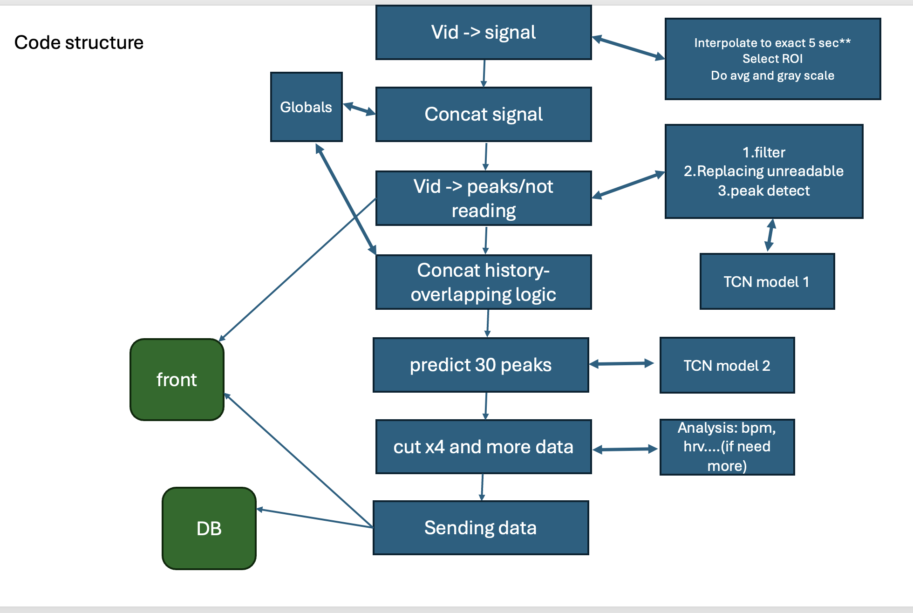
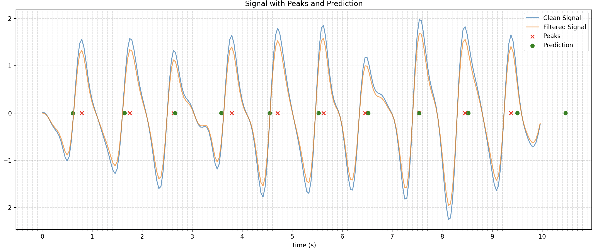

## Heart Monitor App

**Note:** This project was developed as part of a practicum in the Brain Lab of Prof. Amir Amedi at Reichman University.

## Description

A mobile biofeedback app that uses machine learning to guide users through heart-based training via their phone camera.  
The app captures real-time pulse data through the phone’s camera, processes it to extract heartbeats, and then plays synchronized audio based on predicted future heartbeats.  
This system supports research in interoception and neuroplasticity by enabling accessible, real-time biofeedback training on mobile devices.

## Demo

[Watch the demo](https://www.youtube.com/shorts/ZayBn7RVBaY)

## Technology & Architecture

- The **frontend** captures short looping videos of the user’s finger and plays audio cues based on backend predictions.
- The **backend**:
  1. Converts each video into a PPG signal.
  2. Detects heartbeat peaks.
  3. Uses a pre-trained **MLP model** to predict future peaks.
  4. Converts the predicted peaks into an audio track and sends it back to the app.

The graph below visualizes the predicted heartbeat timing versus the actual detected peaks:

## Technology Stack

- **Frontend:** Flutter, Dart  
- **Backend:** Flask, Python  
- **Database:** PostgreSQL  
- **Hosting:** Azure (App Service + Database)
